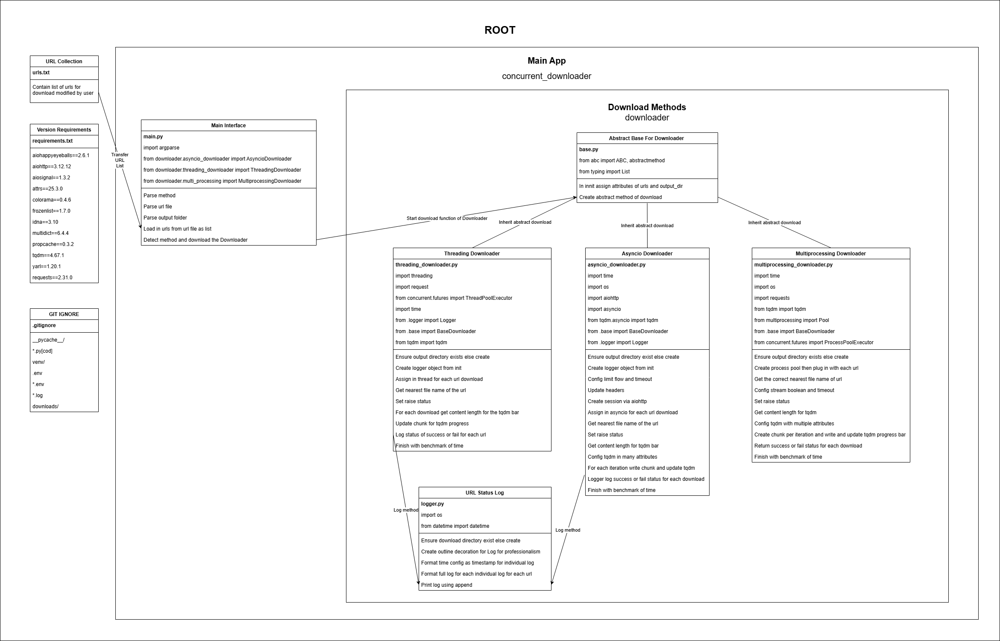

# Concurrency-Project-CLI-Concurrent-Downloader
Hi! This is a big project from the topic Concurrency from my Software Architect and DevSecOps Engineer road map. For the concurrency project, I'm creating a CLI (Command-line Interface) Concurrent Downloader to download data from such websites concurrently! Follow instructions of how_to_use.txt to use it. Check out my benchmark and analysis comparing downloading using threading, asyncio, and multiprocessing of 10 URLS and 100 URLS in my Road Map Repo: https://github.com/WillyPhan06/Software-Architect-and-DevSecOps-Engineer-Road-Map/tree/main/Concurrency/FinalProject. Below is high level design of my CLI Concurrent Downloader!

📘 HOW TO USE - Concurrent Downloader CLI Tool

This project allows you to download multiple files concurrently using threading, asyncio, or multiprocessing in Python.

✅ Requirements
Python 3.10+

Visual Studio Code (VS Code) is recommended

🧠 Step-by-Step Instructions
🔧 Step 0: Clone the Repository
Open VS Code

Press Ctrl + ~ to open the terminal

Navigate to a folder where you want to store the project:

bash
Copy
Edit
cd path/to/your/folder
Clone the repo:

bash
Copy
Edit
git clone https://github.com/your-username/Concurrency-Project-CLI-Concurrent-Downloader.git
Navigate into the project folder:

bash
Copy
Edit
cd Concurrency-Project-CLI-Concurrent-Downloader
🐍 Step 1: Set Up Virtual Environment
Run the following command to create a virtual environment:

bash
Copy
Edit
python -m venv venv
Activate the virtual environment:

On Windows (CMD):

bash
Copy
Edit
venv\Scripts\activate
On Windows PowerShell:

bash
Copy
Edit
.\venv\Scripts\Activate.ps1
On Mac/Linux:

bash
Copy
Edit
source venv/bin/activate
Install dependencies (if any are added in future):

bash
Copy
Edit
pip install -r requirements.txt
🌐 Step 2: Edit urls.txt
Open urls.txt in VS Code.

Add one URL per line that you want to download content from.
Example:

arduino
Copy
Edit
https://example.com/file1.jpg
https://example.com/file2.jpg
📥 Step 3: Run the Downloader
Make sure you're in the main project folder (Concurrency-Project-CLI-Concurrent-Downloader).

Choose one of the following methods:

▶️ Download using Threading:
bash
Copy
Edit
python concurrent_downloader/main.py --method threading --url-file urls.txt --output-dir downloads
▶️ Download using Asyncio:
bash
Copy
Edit
python concurrent_downloader/main.py --method asyncio --url-file urls.txt --output-dir downloads
▶️ Download using Multiprocessing:
bash
Copy
Edit
python concurrent_downloader/main.py --method multiprocessing --url-file urls.txt --output-dir downloads
⏳ Step 4: Wait for Completion
The terminal will show a "Done" message along with the total time taken.

Progress and status will be printed while downloading.

📁 Step 5: Check Your Downloads
All downloaded files will be saved inside the downloads/ folder.

If you used threading or asyncio, a log.txt file will also be generated inside downloads/, containing detailed logs of the download process.

💡 Tips
Make sure the URLs in urls.txt are valid and accessible.

To restart, just clear downloads/ and re-run a method.

